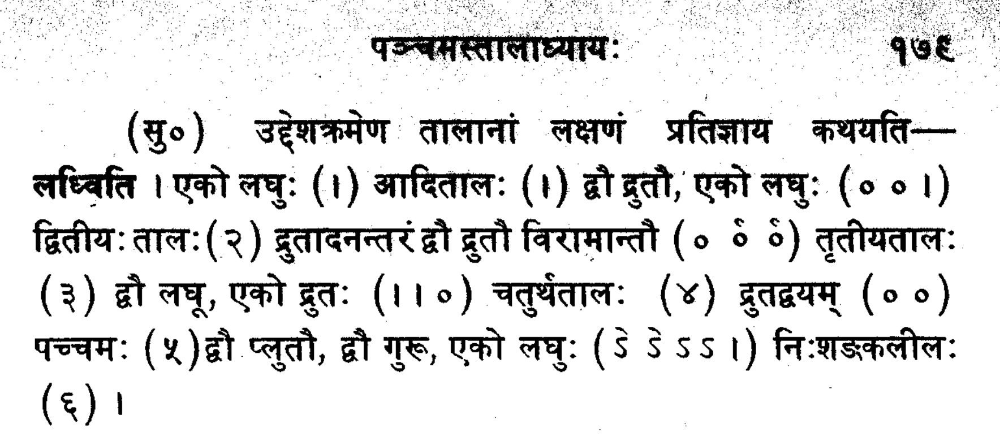

# decitala
[![Wiki][wiki-img]][wiki]
[](https://github.com/Luke-Poeppel/decitala/actions)


The ``decitala`` package aims to make rhythmic analysis of Olivier Messiaen's music easier, particularly with respect to his use of ethnological rhythmic fragments.  



**Page introducting the desītālas in** _Tālādhyāya_ **of the Saṅgītaratnākara**. 

_"To introduce the tālas gradually, their characteristics––having been promised––are thus explained –– lightly: One laghu (|) āditāla (1) two drutas, one laghu (o o |) the dvitiya tāla (2) one druta, two druta viramas (o oc oc) the tṛtīya tāla (3) two laghus, one druta (| | o) the caturtha tāla (4) both of them drutas (o o) pacchamaḥ (5) two plutas, two gurus, one laghu (Sc Sc S S |) niḥśaṅkalīla (6) |"_

### Documentation
Available at: https://luke-poeppel.github.io/decitala/.

### Installation
```
>>> cd # Navigate to home directory
>>> git clone https://github.com/Luke-Poeppel/decitala
>>> cd decitala
>>> pip3 install -e .
>>> pre-commit install
>>> decitala --version # Check for proper installation.
```

### Requirements
- This package requires music21 which is available here:  https://github.com/cuthbertLab/music21. 
- To make Treant FragmentTree diagrams within the ``vis.py`` module, you will need the Browserify.js library which can be downloaded by ``npm install -g browserify``. 
- Also recommended is the following application for viewing SQLite databases, freely available at https://sqlitebrowser.org/. 

### Why is it called decitala?
Śārngadeva (शार्ङ्गदेव) compiled a list of 130 rhythmic fragments called desītālas (देसी ताल) in his 13th-century musicological treatise, the Sangītaratnākara (सङ्गीतरत्नाकर). Messiaen used the gallicized "deçi-tâlas" in his writing which has been simplified here to "decitala."


  [wiki-img]: https://img.shields.io/badge/docs-Wiki-blue.svg
  [wiki]: https://luke-poeppel.github.io/decitala/