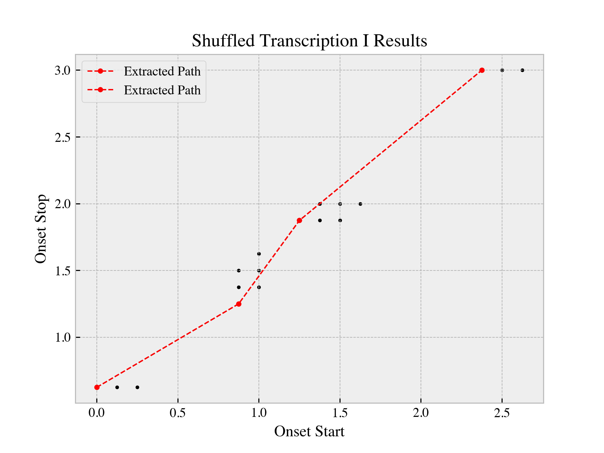

===
vis
===
.. automodule:: decitala.vis
   :members:
   :member-order: bysource
   :show-inheritance:

.. figure:: ../_static/Prosodic_Tree.png
   :scale: 30 %

   The Fragment Tree of Greek Prosodic Feet

.. figure:: ../_static/Fragment_Roll.png
   :scale: 30 %

   Fragment Roll diagram of Sept Haïkaï (Bois)

   2D Plot of Search and Path Results for Fake Composition. 

